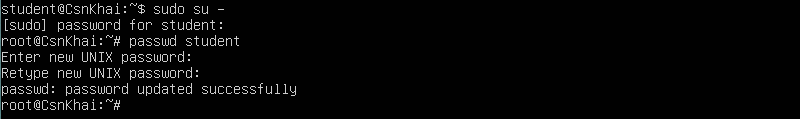
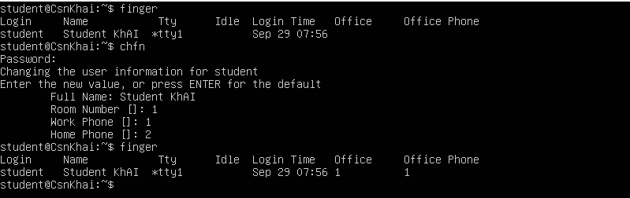
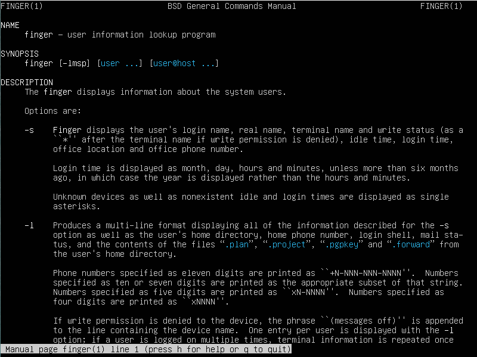
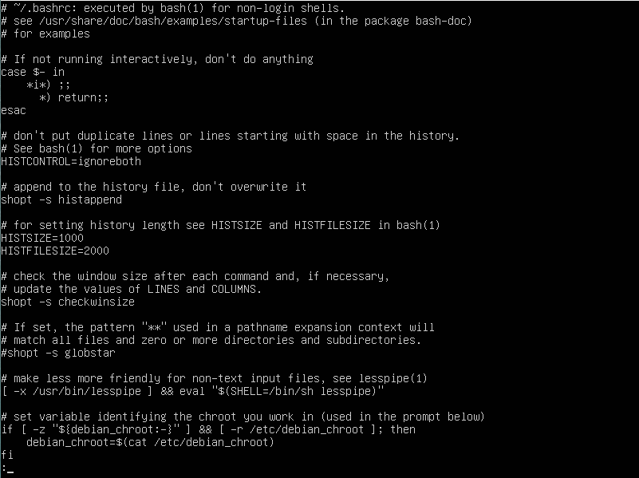
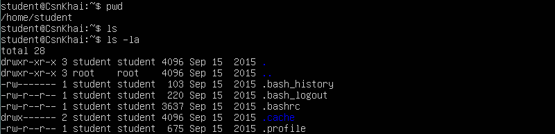

## Task1.Part1

1. Log in to the system as root.
2. Use the passwd command to change the password. Examine the basic
parameters of the command. What system file does it change *?

3. Determine the users registered in the system, as well as what commands they
execute. What additional information can be gleaned from the command
execution?

4. Change personal information about yourself.

5. Become familiar with the Linux help system and the man and info commands.
Get help on the previously discussed commands, define and describe any two
keys for these commands. Give examples.

6. Explore the more and less commands using the help system. View the contents
of files .bash* using commands.

7. *Describe in plans that you are working on laboratory work 1. Tip: You should
read the documentation for the finger command.
8. *List the contents of the home directory using the ls command, define its files
and directories. Hint: Use the help system to familiarize yourself with the ls
command.

